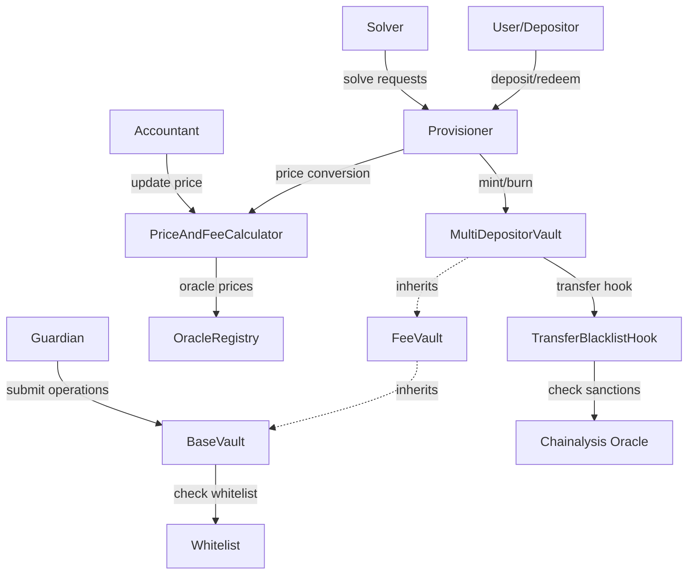
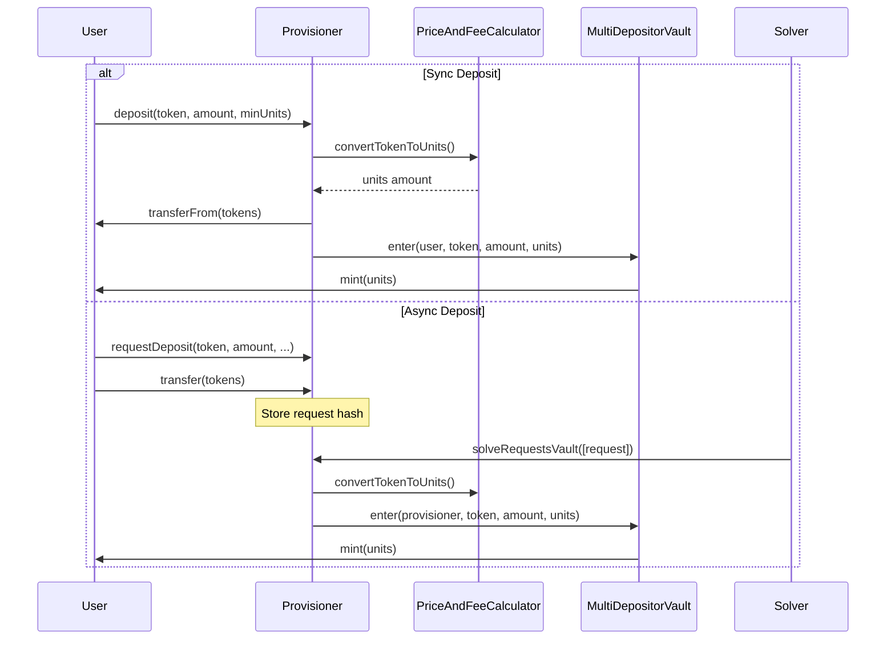
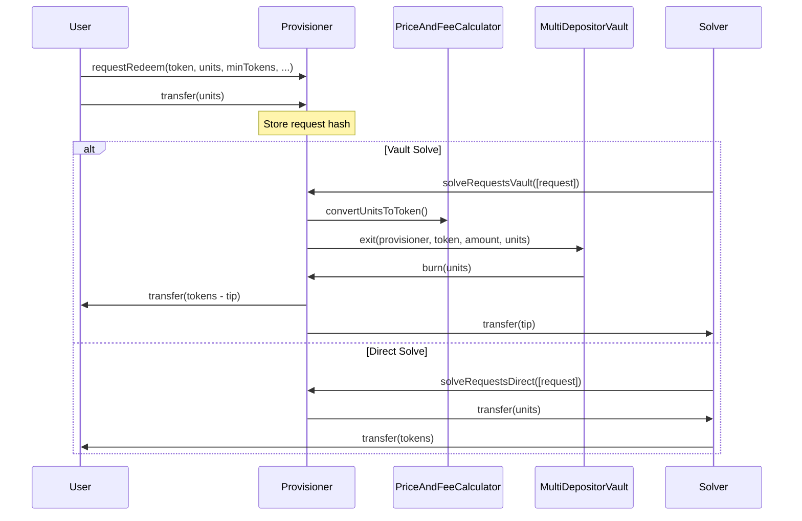

# Protocol Security Analysis Report

## Executive Summary

This report provides a comprehensive security analysis of a multi-contract DeFi protocol deployed on Base mainnet. The protocol consists of five main components that work together to enable multi-asset deposits/withdrawals with price management, fee calculation, access control, and transfer restrictions.

## 1. Protocol Architecture Overview

### Core Components

1. **MultiDepositorVault** - ERC20 vault token that mints/burns units for deposits/withdrawals
2. **Provisioner** - Entry/exit point managing all deposits and redemptions
3. **PriceAndFeeCalculator** - Oracle and fee engine for price updates and fee accrual
4. **Whitelist** - Access control for guardian addresses
5. **TransferBlacklistHook** - Transfer restriction mechanism using sanctions oracle

### Architecture Diagram



## 2. Component Analysis

### 2.1 Provisioner Contract

**Purpose**: Central entry/exit point for all vault deposits and redemptions

**Key Functions**:
- `deposit()` / `mint()` - Synchronous deposits with immediate unit minting
- `requestDeposit()` / `requestRedeem()` - Asynchronous requests for later solving
- `solveRequestsVault()` - Authorized solvers process async requests through vault
- `solveRequestsDirect()` - Anyone can solve fixed-price requests directly
- `refundDeposit()` / `refundRequest()` - Refund mechanisms for deposits/requests

**Critical State Variables**:
- `tokensDetails` - Per-token configuration (multipliers, enabled flags)
- `depositCap` - Maximum TVL in numeraire terms
- `depositRefundTimeout` - Time window for sync deposit refunds
- `syncDepositHashes` / `asyncDepositHashes` / `asyncRedeemHashes` - Request tracking
- `userUnitsRefundableUntil` - Locks user units during refund window

**Security Features**:
- ReentrancyGuardTransient protection
- Hash-based request replay prevention
- Deposit cap enforcement
- Price age validation
- Multiplier bounds checking (MIN/MAX_DEPOSIT/REDEEM_MULTIPLIER)

### 2.2 MultiDepositorVault Contract

**Purpose**: ERC20 vault token representing user shares

**Key Functions**:
- `enter()` - Mint units for deposits (only callable by provisioner)
- `exit()` - Burn units for withdrawals (only callable by provisioner)
- `_update()` - Override with transfer hook and unit lock checks

**Security Features**:
- Only provisioner can mint/burn
- Transfer hooks for blacklist checking
- Unit locking during refund periods
- Pausable functionality inherited from BaseVault

### 2.3 PriceAndFeeCalculator Contract

**Purpose**: Price oracle and fee accrual engine

**Key Functions**:
- `setUnitPrice()` - Update vault unit price (accountant only)
- `convertUnitsToToken()` / `convertTokenToUnits()` - Price conversions
- `pauseVault()` / `unpauseVault()` - Emergency pause mechanism
- `setThresholds()` - Configure price tolerance and update intervals

**Critical Thresholds**:
- `minPriceToleranceRatio` / `maxPriceToleranceRatio` - Price change limits
- `minUpdateIntervalMinutes` - Minimum time between updates
- `maxPriceAge` - Maximum allowed price staleness
- `maxUpdateDelayDays` - Maximum time without updates

**Fee Calculation**:
- TVL-based fees accrued over time
- Performance fees on new highs
- Separate vault and protocol fee tracking

### 2.4 Whitelist Contract

**Purpose**: Maintain list of authorized guardian addresses

**Key Functions**:
- `setWhitelisted()` - Add/remove addresses from whitelist
- `isWhitelisted()` - Check if address is whitelisted
- `getAllWhitelisted()` - Get all whitelisted addresses

### 2.5 TransferBlacklistHook

**Purpose**: Block sanctioned addresses from transferring vault units

**Key Functions**:
- `beforeTransfer()` - Called before each transfer to check sanctions

## 3. User Flow Analysis

### Deposit Flow



### Redeem Flow



## 4. Vulnerability Analysis

### 4.1 Critical Vulnerabilities Identified

#### Vulnerability 1: Price Manipulation Through Sandwich Attack

**Severity**: HIGH
**Category**: Price Manipulation

**Description**: 
The protocol's price update mechanism in `PriceAndFeeCalculator` allows an accountant to set arbitrary prices within tolerance bounds. A malicious or compromised accountant could manipulate prices to extract value.

**Attack Vector**:
1. Accountant observes pending large deposit in mempool
2. Front-runs with price decrease (within `minPriceToleranceRatio`)
3. User gets more units than deserved
4. Back-runs with price increase to restore
5. Attacker redeems inflated units for profit

**Affected Code**:
```solidity
// PriceAndFeeCalculator.sol:155-188
function setUnitPrice(address vault, uint128 price, uint32 timestamp) 
    external onlyVaultAccountant(vault) {
    // No validation against market price
    // Only checks tolerance from last price
}
```

**Mitigation**: 
- Implement TWAP or external oracle validation
- Add time-weighted price smoothing
- Require multiple accountant signatures

#### Vulnerability 2: Reentrancy in Direct Solve Mechanism

**Severity**: MEDIUM-HIGH
**Category**: Reentrancy

**Description**:
The `solveRequestsDirect()` function in Provisioner transfers tokens/units before completing state updates, potentially allowing reentrancy through malicious token callbacks.

**Attack Vector**:
1. Create malicious ERC20 token with callback in transfer
2. Request deposit with malicious token
3. In callback, re-enter to solve same request again
4. Double-spend the deposited tokens

**Affected Code**:
```solidity
// Provisioner.sol:764-791
function _solveDepositDirect(IERC20 token, Request calldata request) internal {
    // ...
    asyncDepositHashes[depositHash] = false; // State change
    // ...
    IERC20(MULTI_DEPOSITOR_VAULT).safeTransferFrom(msg.sender, request.user, request.units);
    token.safeTransfer(msg.sender, request.tokens); // External call
}
```

**Mitigation**:
- Add `nonReentrant` modifier to individual solve functions
- Follow checks-effects-interactions pattern strictly

#### Vulnerability 3: Deposit Cap Bypass Through Multiple Transactions

**Severity**: MEDIUM
**Category**: Logic Flaw

**Description**:
The deposit cap check in `_requireDepositCapNotExceeded()` only validates against current state, allowing bypass through multiple simultaneous transactions.

**Attack Vector**:
1. Submit multiple deposit transactions in same block
2. Each individually passes cap check
3. Combined deposits exceed cap
4. Protocol accepts more TVL than intended

**Affected Code**:
```solidity
// Provisioner.sol:920-925
function _isDepositCapExceeded(uint256 units) internal view returns (bool) {
    uint256 newTotal = IERC20(MULTI_DEPOSITOR_VAULT).totalSupply() + units;
    // Race condition: multiple txs can pass this check
    return PRICE_FEE_CALCULATOR.convertUnitsToNumeraire(MULTI_DEPOSITOR_VAULT, newTotal) > depositCap;
}
```

**Mitigation**:
- Implement atomic cap reservation system
- Use mutex or queue for deposit processing

### 4.2 Medium Severity Issues

#### Issue 1: Insufficient Validation of Request Parameters

**Description**: 
Request creation functions don't validate relationships between parameters (e.g., `solverTip` vs `tokensIn`), potentially leading to unsolvable requests.

**Location**: `Provisioner.sol:180-258`

#### Issue 2: Centralized Price Control

**Description**:
Single accountant can pause vault and manipulate prices within bounds, creating systemic risk.

**Location**: `PriceAndFeeCalculator.sol:155-188`

#### Issue 3: Hash Collision Potential

**Description**:
Request hashes use `abi.encodePacked` which can theoretically lead to collisions with carefully crafted inputs.

**Location**: `Provisioner.sol:1015-1033`

### 4.3 Low Severity Issues

1. **Missing Event Emissions**: Some state changes lack events
2. **Unbounded Array Operations**: `solveRequestsVault` has no limit on array size
3. **Timestamp Manipulation**: Minor dependency on `block.timestamp`

## 5. Exploit Scenarios

### Scenario 1: Accountant Price Manipulation Attack

```solidity
// Step 1: Accountant reduces price by maximum allowed
priceCalculator.setUnitPrice(vault, 
    currentPrice * minPriceToleranceRatio / 10000, 
    block.timestamp);

// Step 2: Accomplice deposits large amount
provisioner.deposit(token, largeAmount, minUnits);
// Gets inflated units due to low price

// Step 3: Accountant restores price
priceCalculator.setUnitPrice(vault, 
    normalPrice, 
    block.timestamp + minInterval);

// Step 4: Accomplice redeems for profit
provisioner.requestRedeem(token, inflatedUnits, ...);
```

**Expected Profit**: (1 - minPriceToleranceRatio/10000) * depositAmount

### Scenario 2: Reentrancy Attack on Direct Solve

```solidity
contract MaliciousToken {
    function transfer(address to, uint256 amount) external returns (bool) {
        // Re-enter provisioner
        provisioner.solveRequestsDirect(this, requests);
        return true;
    }
}
```

## 6. Recommendations

### High Priority

1. **Implement External Price Validation**
   - Add Chainlink or similar oracle for price verification
   - Require price to be within X% of external oracle

2. **Fix Reentrancy Vulnerabilities**
   - Add reentrancy guards to all external-facing functions
   - Reorder operations to follow CEI pattern

3. **Enhance Deposit Cap Mechanism**
   - Implement reservation system for deposits
   - Add per-block deposit limits

### Medium Priority

1. **Decentralize Price Updates**
   - Require multiple signatures for price changes
   - Implement time delays for significant changes

2. **Improve Hash Generation**
   - Use `abi.encode` instead of `abi.encodePacked`
   - Add nonces to prevent any collision possibility

3. **Add Circuit Breakers**
   - Automatic pause on abnormal activity
   - Rate limiting for critical operations

### Low Priority

1. Add comprehensive event logging
2. Implement array size limits
3. Consider using block number instead of timestamp where possible

## 7. Glossary

| Term | Definition |
|------|------------|
| **Numeraire** | Base currency for pricing (e.g., USD) |
| **Units** | Vault share tokens representing ownership |
| **Provisioner** | Contract managing deposits/withdrawals |
| **Accountant** | Authorized entity updating prices |
| **Guardian** | Authorized entity executing vault operations |
| **Solver** | Entity fulfilling async deposit/redeem requests |
| **TVL** | Total Value Locked in the protocol |
| **TWAP** | Time-Weighted Average Price |
| **CEI** | Checks-Effects-Interactions pattern |

## Conclusion

The protocol demonstrates sophisticated design with multiple security layers, but contains critical vulnerabilities primarily around price manipulation and reentrancy. The centralized price update mechanism poses the highest risk, potentially enabling significant value extraction. Immediate attention should focus on implementing external price validation and fixing reentrancy issues before any mainnet deployment or continued operation.