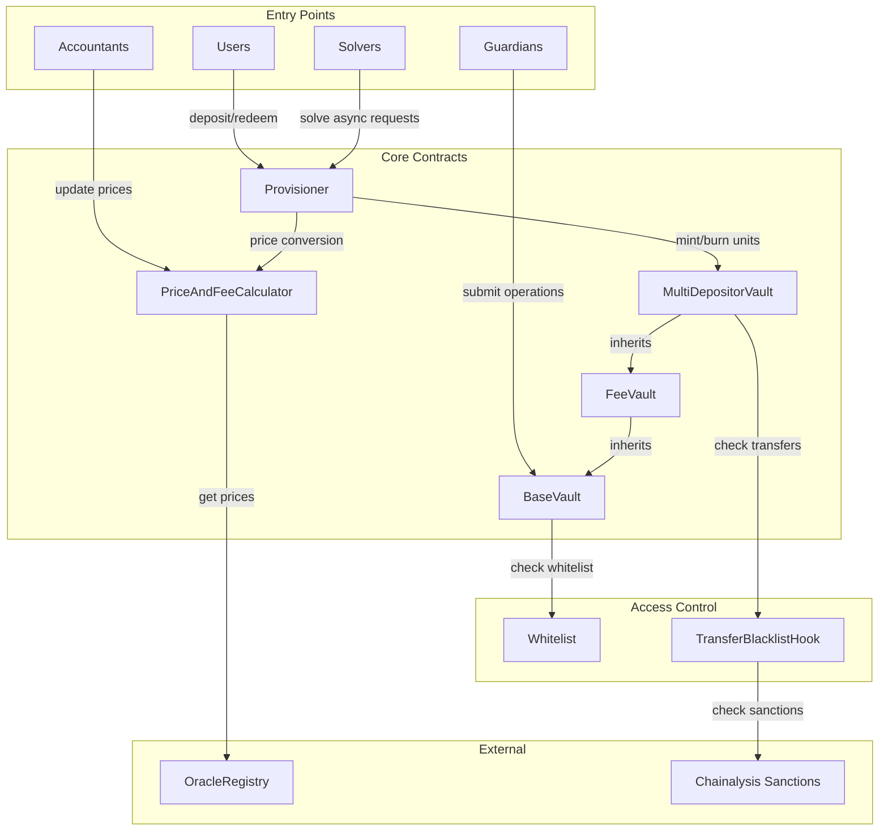
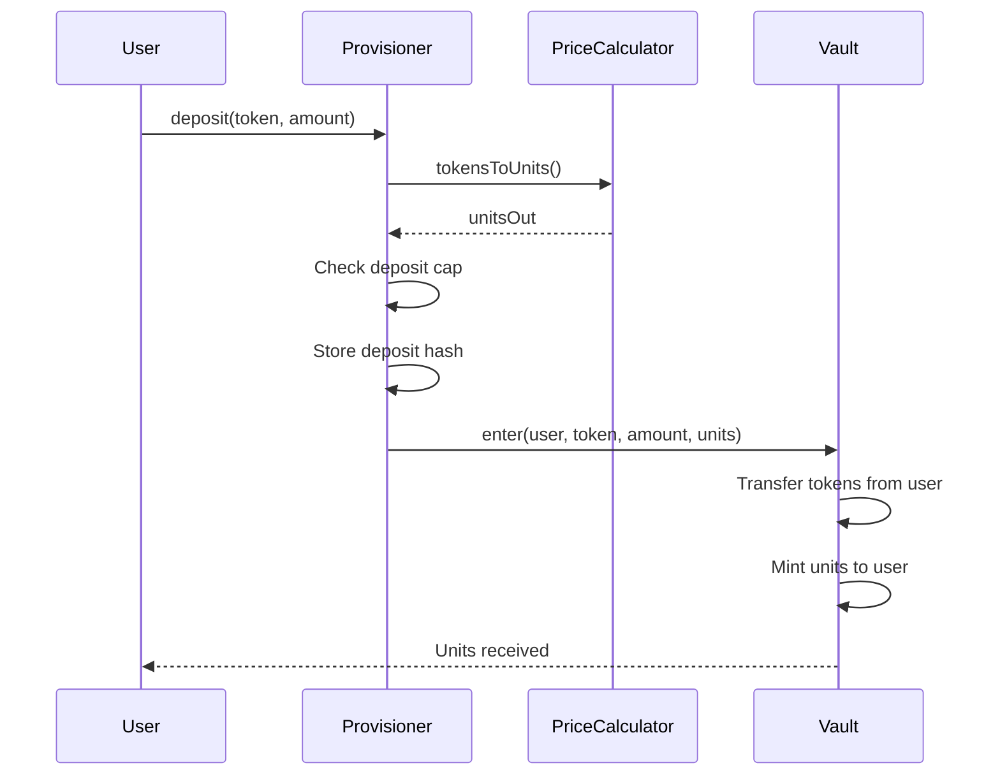
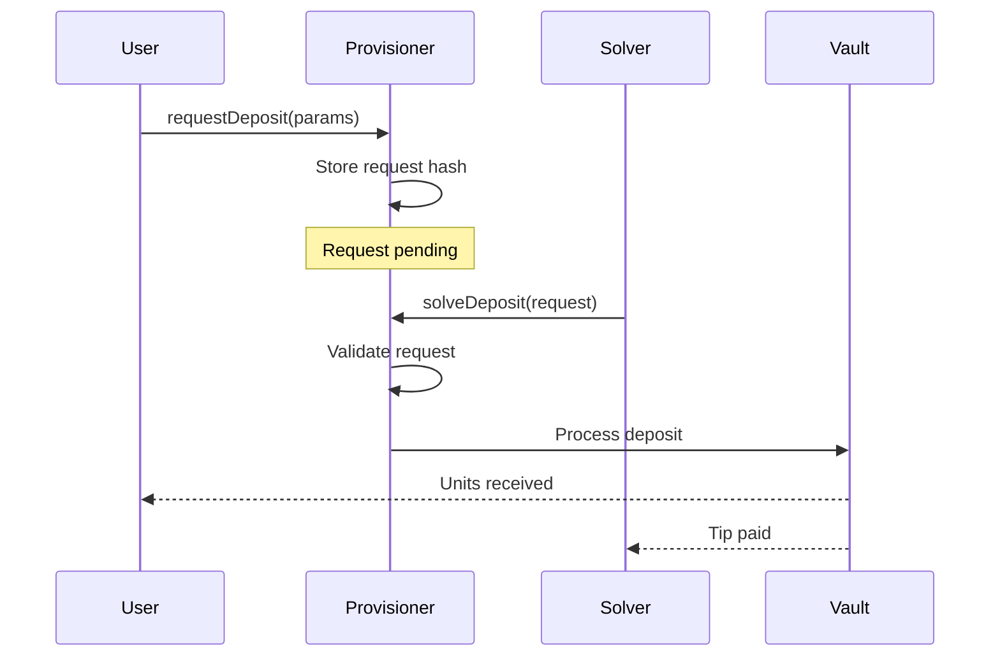

# Aera Protocol Security Analysis

## Executive Summary

The Aera Protocol is a sophisticated vault system designed for multi-token deposits and redemptions with advanced fee management, price calculation, and access control mechanisms. The protocol consists of five main components working in concert to provide a secure and flexible DeFi vault infrastructure.

## Protocol Architecture Overview

### Core Components

## Component Analysis

### 1. MultiDepositorVault (MDV)

**Purpose:** Core vault contract that manages unit tokens (shares) for depositors.

**Key Functionality:**
- Mints and burns vault units (ERC20 tokens)
- Enforces transfer restrictions via hooks
- Manages provisioner-only operations
- Inherits from BaseVault and FeeVault

**Critical Functions:**
- `enter()`: Mints units for deposits (provisioner only)
- `exit()`: Burns units for withdrawals (provisioner only)
- `_update()`: Validates transfers via hooks and unit lock checks

**Security Features:**
- Provisioner-only minting/burning
- Transfer hooks for blacklist checking
- Unit locking mechanism during refund periods

### 2. Provisioner

**Purpose:** Entry and exit point for all vault deposits and redemptions.

**Key Functionality:**
- Handles sync and async deposits
- Manages async redemptions (no sync redemptions)
- Enforces deposit caps and refund timeouts
- Prevents replay attacks via hash tracking

**Deposit Types:**
1. **Sync Deposits** (`deposit()`/`mint()`):
   - Instant processing
   - Refundable for `depositRefundTimeout` period
   - Units locked during refund period

2. **Async Deposits** (`requestDeposit()`):
   - Creates pending requests
   - Can be solved by authorized solvers or anyone
   - Includes solver tips and deadlines

3. **Async Redemptions** (`requestRedeem()`):
   - All redemptions are async
   - Similar solver mechanism as deposits

**Critical State:**
- `depositCap`: Maximum TVL in numeraire terms
- `depositRefundTimeout`: Sync deposit refund period
- `syncDepositHashes`: Tracks active sync deposits
- `asyncDepositHashes`: Tracks pending async deposits
- `asyncRedeemHashes`: Tracks pending async redemptions
- `userUnitsRefundableUntil`: Unit lock timestamps

### 3. PriceAndFeeCalculator

**Purpose:** Manages unit prices and fee accrual for multiple vaults.

**Key Functionality:**
- Price oracle for vault units
- Fee accrual engine (TVL and performance fees)
- Threshold-based price validation
- Pause mechanism for price anomalies
- Multi-vault support

**Price Update Workflow:**
1. Vault registration via `registerVault()`
2. Threshold setting via `setThresholds()`
3. Initial price via `setInitialPrice()`
4. Regular updates via `setUnitPrice()`

**Threshold Checks:**
- Price change tolerance (min/max ratios)
- Update interval requirements
- Price staleness limits
- Maximum update delays

**Fee Types:**
- TVL fees: Based on total value locked
- Performance fees: Based on price appreciation
- Protocol fees: Platform revenue share

### 4. BaseVault

**Purpose:** Core vault functionality for guardian-managed operations.

**Key Functionality:**
- Guardian operation submission
- Merkle tree-based operation authorization
- Before/after submit hooks
- Callback handling for flash loans
- Approval management

**Operation Flow:**
1. Guardian submits operations with merkle proofs
2. Before-submit hooks execute
3. Operations validated against merkle root
4. Operations executed with callback support
5. After-submit hooks execute
6. Approval invariants checked

### 5. Access Control System

**Whitelist Contract:**
- Maintains approved addresses
- Owner-controlled whitelist management
- Used by BaseVault for guardian validation

**TransferBlacklistHook:**
- Validates transfers before execution
- Integrates with Chainalysis sanctions oracle
- Prevents transfers to/from blacklisted addresses

## User Flows

### Deposit Flow

### Async Request Flow

## Glossary

| Term | Definition |
|------|------------|
| **Units** | ERC20 tokens representing vault shares |
| **Numeraire** | Base currency for price calculations and deposit caps |
| **Sync Deposit** | Instant deposit with refund period |
| **Async Deposit** | Pending deposit requiring solver |
| **Solver** | Entity that fulfills async requests |
| **Guardian** | Authorized entity managing vault operations |
| **Accountant** | Entity responsible for price updates |
| **Deposit Cap** | Maximum TVL limit in numeraire terms |
| **Refund Timeout** | Period during which sync deposits can be refunded |
| **Unit Lock** | Restriction preventing unit transfers during refund period |
| **Merkle Root** | Root hash for operation authorization |
| **Submit Hooks** | Pre/post operation validation logic |
| **Callback Handler** | Flash loan callback processor |
| **Price Threshold** | Limits for valid price updates |
| **Accrual Lag** | Time between price updates when paused |
| **TVL Fee** | Fee based on total value locked |
| **Performance Fee** | Fee based on price appreciation |

## Security Considerations

### Access Control
- Multi-role system (owner, guardian, accountant, solver)
- Whitelist-based guardian management
- Sanctions compliance via Chainalysis

### Price Manipulation Protection
- Threshold-based validation
- Pause mechanism for anomalies
- Time-based update restrictions

### Replay Protection
- Hash-based request tracking
- Nonce-less design using unique hashes

### Fund Safety
- Provisioner-only minting/burning
- Refund mechanisms for deposits
- Unit locking during refund periods