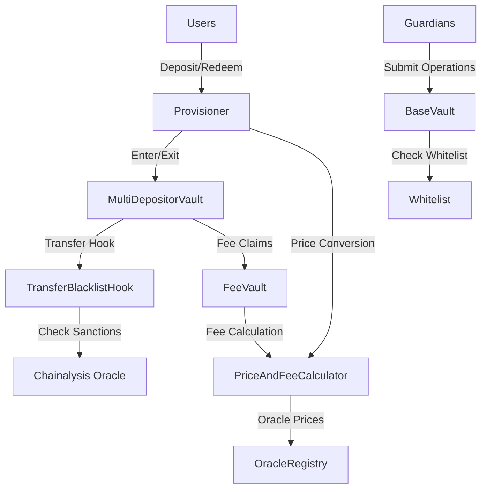
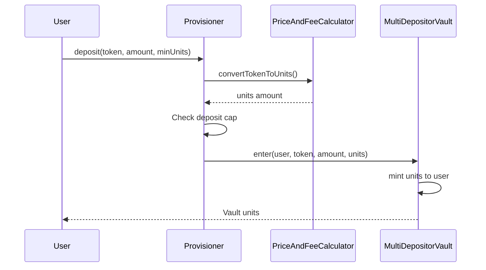
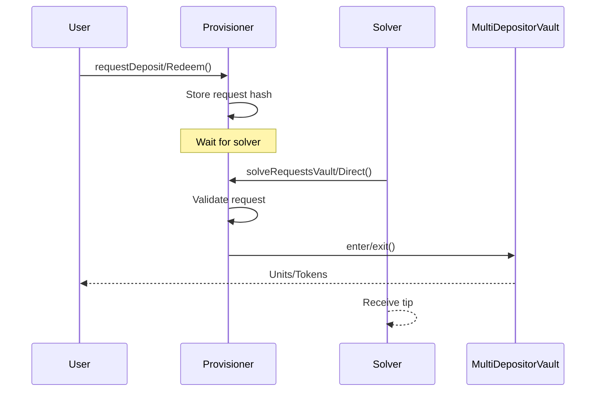

# Aera Vault Protocol Security Analysis

## 1. Protocol Overview

### Architecture Components

The Aera protocol consists of five main smart contract components deployed on Base mainnet:

1. **MultiDepositorVault** - ERC20 vault token that manages user deposits/withdrawals
2. **Provisioner** - Entry/exit point handling deposits and redemptions with sync/async flows
3. **PriceAndFeeCalculator** - Manages unit pricing and fee accrual for vaults
4. **Whitelist** - Access control for guardian addresses
5. **TransferBlacklistHook** - Blocks sanctioned addresses from transferring vault units

### Protocol Architecture Diagram



### Key Functionality

1. **Deposits/Withdrawals**: Users interact through Provisioner for entering/exiting vaults
2. **Price Management**: PriceAndFeeCalculator maintains unit prices and converts between tokens/units
3. **Fee Accrual**: TVL and performance fees accrue based on price updates
4. **Guardian Operations**: Whitelisted guardians can execute vault operations via merkle proofs
5. **Transfer Controls**: Hook system prevents blacklisted addresses from transferring vault units

## 2. User Flow Analysis

### Deposit Flow



### Async Request Flow



## 3. Vulnerability Analysis

### Critical Findings

#### 1. Price Manipulation via Accrual Lag Exploit

**Severity**: CRITICAL
**Impact**: Theft of unclaimed yield, incorrect fee calculations
**Location**: `PriceAndFeeCalculator.sol`

**Vulnerability Details**:
The accrual lag mechanism in price updates can be exploited to manipulate fee calculations:

```solidity
// PriceAndFeeCalculator.sol lines 165-179
if (_shouldPause(vaultPriceState, price, timestamp)) {
    _setVaultPaused(vaultPriceState, vault, true);
    unchecked {
        // Vulnerability: accrualLag set without fee accrual
        vaultPriceState.accrualLag = uint24(timestamp - vaultPriceState.timestamp);
    }
} else {
    _accrueFees(vault, price, timestamp);
}
```

When a vault is paused, the accrual lag is set but fees are not accrued. Upon unpause:

```solidity
// Line 210-211
function unpauseVault(address vault, uint128 price, uint32 timestamp) external requiresVaultAuth(vault) {
    // ...
    _accrueFees(vault, price, timestamp);
    // Uses stale price/timestamp with accumulated lag
}
```

**Attack Vector**:
1. Accountant triggers pause condition with extreme price
2. Time passes accumulating lag
3. Owner unpauses with same price/timestamp
4. Fee accrual uses incorrect time delta including the lag period
5. Performance fees calculated on artificial gains

#### 2. Reentrancy in Direct Solve Functions

**Severity**: HIGH  
**Impact**: Double spending of requests, fund drainage
**Location**: `Provisioner.sol`

**Vulnerability Details**:
The `solveRequestsDirect` function lacks reentrancy protection while making external calls:

```solidity
// Provisioner.sol line 358
function solveRequestsDirect(IERC20 token, Request[] calldata requests) external nonReentrant {
    // ...
    _solveDepositDirect(token, requests[i]);
}

// Line 777-781
function _solveDepositDirect(IERC20 token, Request calldata request) internal {
    // State change after external call
    IERC20(MULTI_DEPOSITOR_VAULT).safeTransferFrom(msg.sender, request.user, request.units);
    token.safeTransfer(msg.sender, request.tokens);
}
```

**Attack Vector**:
1. Create malicious ERC20 token with callback in transfer
2. Submit deposit request with malicious token
3. In callback, re-enter `solveRequestsDirect` 
4. Solve same request multiple times before hash is cleared

#### 3. Hash Collision in Sync Deposits

**Severity**: MEDIUM
**Impact**: Denial of service, locked funds
**Location**: `Provisioner.sol`

**Vulnerability Details**:
Deposit hash calculation uses predictable parameters:

```solidity
// Line 985-992
function _getDepositHash(
    address user,
    IERC20 token,
    uint256 tokenAmount,
    uint256 unitsAmount,
    uint256 refundableUntil
) internal pure returns (bytes32) {
    return keccak256(abi.encodePacked(user, token, tokenAmount, unitsAmount, refundableUntil));
}
```

The `refundableUntil` is `block.timestamp + depositRefundTimeout` where timeout can change.

**Attack Vector**:
1. Front-run user deposit with same parameters
2. Cause hash collision preventing legitimate deposit
3. User funds locked until timeout changes

#### 4. Unchecked Multiplier Application

**Severity**: MEDIUM
**Impact**: Incorrect pricing, loss of funds
**Location**: `Provisioner.sol`

**Vulnerability Details**:
Multiplier application can cause precision loss:

```solidity
// Line 937
uint256 tokensAdjusted = tokens * multiplier / ONE_IN_BPS;
```

With small token amounts and multipliers < ONE_IN_BPS, division truncates to 0.

**Attack Vector**:
1. Deposit minimal token amount with low multiplier
2. Receive 0 units due to truncation
3. Tokens locked in vault with no units minted

#### 5. Guardian Root Override Without Validation

**Severity**: MEDIUM
**Impact**: Unauthorized vault operations
**Location**: `BaseVault.sol`

**Vulnerability Details**:
Guardian roots can be set without validating the merkle tree:

```solidity
// Line 154-156
function setGuardianRoot(address guardian, bytes32 root) external virtual requiresAuth {
    _setGuardianRoot(guardian, root);
}
```

No validation that the root corresponds to valid operations.

**Attack Vector**:
1. Compromised owner sets malicious root
2. Guardian executes arbitrary operations
3. Bypass intended operation restrictions

### Additional Findings

#### 6. Transfer Hook Bypass

**Severity**: LOW
**Impact**: Sanctioned addresses can receive units
**Location**: `TransferBlacklistHook.sol`

The hook only checks during transfers, not during mint operations in deposits.

#### 7. Fee Recipient Frontrunning

**Severity**: LOW  
**Impact**: MEV extraction from fee claims
**Location**: `FeeVault.sol`

Fee claims are not protected against sandwich attacks.

## 4. Exploit Scenarios

### Scenario 1: Price Manipulation Attack

```solidity
// Attack contract
contract PriceManipulationExploit {
    function exploit(IPriceAndFeeCalculator calc, address vault) external {
        // Step 1: Force pause with extreme price
        uint128 extremePrice = type(uint128).max;
        calc.setUnitPrice(vault, extremePrice, uint32(block.timestamp));
        
        // Step 2: Wait for lag accumulation
        // ... time passes ...
        
        // Step 3: Unpause with manipulated state
        calc.unpauseVault(vault, storedPrice, storedTimestamp);
        
        // Fees accrued with incorrect time delta
    }
}
```

### Scenario 2: Reentrancy Attack

```solidity
contract ReentrancyExploit {
    bool attacking;
    
    function transfer(address to, uint256 amount) external returns (bool) {
        if (!attacking) {
            attacking = true;
            // Re-enter provisioner
            provisioner.solveRequestsDirect(this, requests);
        }
        return true;
    }
}
```

## 5. Mitigation Recommendations

### Critical Mitigations

1. **Fix Accrual Lag Logic**:
   - Reset accrual lag to 0 when pausing
   - Require fresh price/timestamp on unpause
   - Add validation for time consistency

2. **Add Reentrancy Guards**:
   - Apply `nonReentrant` to all external functions
   - Follow checks-effects-interactions pattern
   - Clear state before external calls

3. **Improve Hash Generation**:
   - Include nonce or unique identifier
   - Use CREATE2-style deterministic addressing
   - Validate against replay attacks

4. **Validate Multipliers**:
   - Add minimum amount checks
   - Use safe math for all calculations
   - Revert on zero results

5. **Guardian Root Validation**:
   - Verify merkle tree structure on submission
   - Limit operation types in tree
   - Add time-based restrictions

### Additional Recommendations

- Implement circuit breakers for extreme price movements
- Add time delays for critical operations
- Use pull pattern for fee distributions
- Implement gradual deposit cap increases
- Add emergency pause mechanisms
- Regular security audits and monitoring

## 6. Conclusion

The Aera vault protocol demonstrates sophisticated design but contains several critical vulnerabilities that could lead to fund loss or manipulation. The most severe issues relate to price manipulation through the accrual lag mechanism and potential reentrancy attacks in the direct solve functions.

Immediate action should be taken to:
1. Fix the accrual lag vulnerability in PriceAndFeeCalculator
2. Add comprehensive reentrancy protection
3. Improve hash collision resistance
4. Validate all multiplier calculations

The protocol would benefit from additional security measures including formal verification of critical paths and comprehensive integration testing of cross-contract interactions.